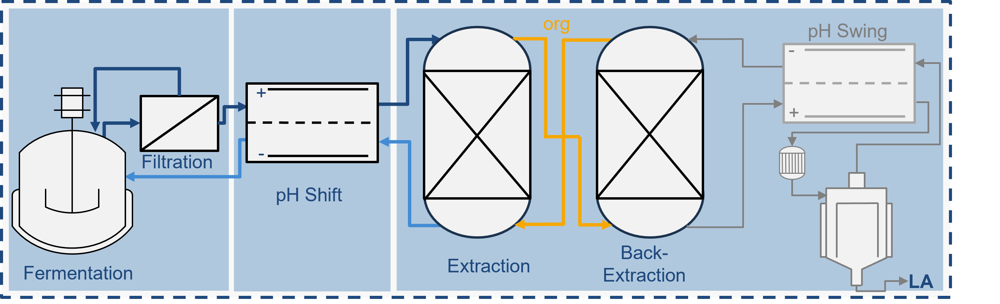
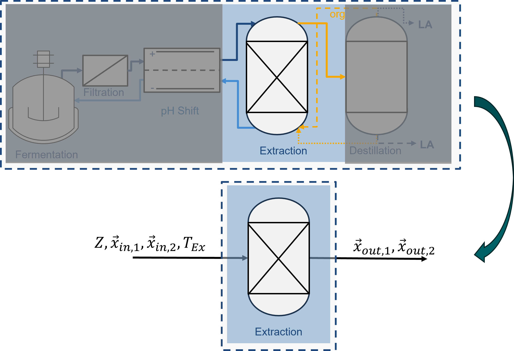
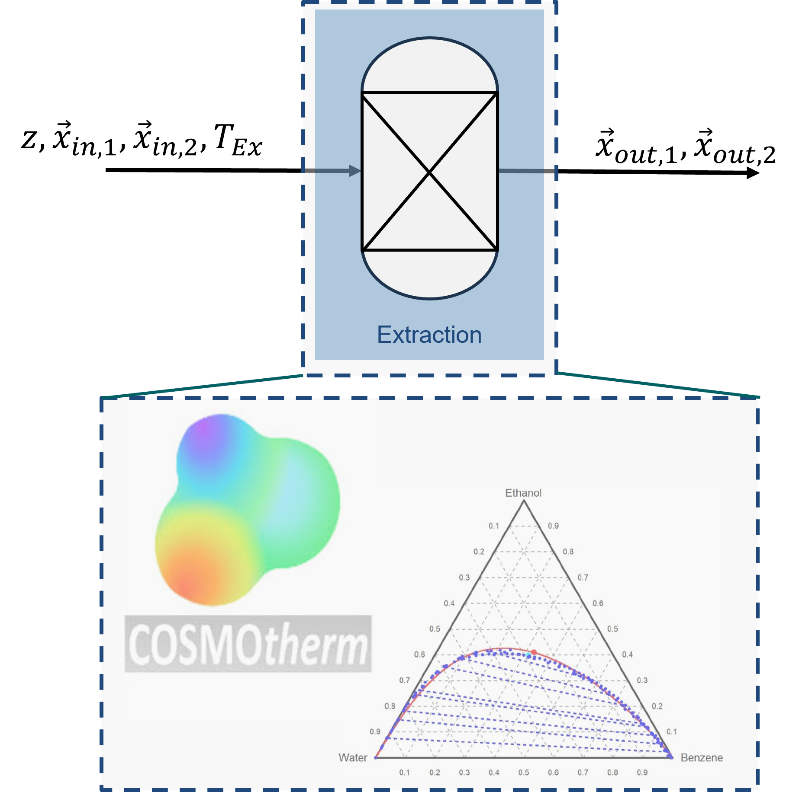

# Lactic Acid Extraction Optimization 

This README is Branch Specific. The Problem setup and the current approach is described here. 

## Problem Statement

We try to optimize the extraction efficiency of the Lactic Acid Extraction process in the Lactic Acid Porduction Chain. The whole production chain can be seen here:

We therefore only focus on a simplieifed 1 Stage extraction process. All other components are ignored for now. 
In a later process the combined econmical and thermodynamical efficiency of the combined extraction and subsequent rectification are considered. 

Input parameters to this process are comprised of the extraction temperature $T_{Ex}$, the input compostion of the fermentation broth and the solvent solution $\vec{x}_{in,1}$, $\vec{x}_{in,2}$ and the chosen solvent $z$. 

The liquid extraction process is simulated with COMSOtherm. Therefore the ouptdata is generated from "LIQEX" COSMOtherm calculations. The COSMOtherm calculation itself is treated as blackbox. 

The extraction efficiency can be described by the following equation: 
$$
\eta_{Ex} = \frac{c_{la,out,1}}{c_{la,out,1}+c_{la,out,2}} 
$$
Where $c_{la,out,1}$ denotes the concentration of lactic acid in the organic/solution phase and $c_{la,out,2}$ the lactic acid concentration in the aqueous phase after the extraction process.

The first simplified optimization problem can thus be defined as:
$$
\max_{T_{Ex},x_{la,in,1},Z} \eta_{Ex}
$$

Since the available data consists only of the mole fraction before and after the extraction the extraction efficiency can not be calculated effectively and accurately. 
To calculate the extraction efficiency we need density $\rho$ and molar mass $M$ of the different phases. 
$$c_i=\frac{x_i \rho}{M}$$

Therefore a surrogate objective is defined as the molar distribution coefficient $K_{dist,x}$:
$$
\max_{T_{Ex},x_{la,in,1},Z} K_{dist,x}
$$
with 
$$
K_{dist,x} = \frac{x_{la,out,1}}{x_{la,out,2}}
$$

## Solvent identification

The solvent as part of the optimization problem, adds an additional layer of complexity since the solvent $z$ can be understood as a categorical variable, meaning the solvents themselfs do not have an inheren numerical value but only certain chemical characteristics asociated with these molecules. 
The other optimization variables like the temperature and initial molar fraction of lactic acid for example can take contious values. 
Therefore an optimization over differnt solvents is non-trivial. 

To solve this issue a ordinal encoding is defined. 
This ordinal encoding assignes each solvent a number between $1$ and $N_{solvents}$. 
The solvents are not encoded randomly but according to a sorting rule which acts on the SMILES representation of the solvents. 
The sorting rule is defined in the next subchapter.

### Solvent Encoding

Assigning numerical values to the otherwise unordered categorical solvents enables us to restate the Mixed Categorical Nonlinear Optimiziation Problem to an Mixed Integer Nonlinear Optimizaion Problem (MINLP). 
The way we encode/assign numerical values to the solvents has a big impact on the performance of optimization algorithms, especially on gradient based optimization algorithms. 

Currently, the solvents are first sorted based to their SMILES notation ascending order by: 
1. The count of 'C' atoms (including both uppercase 'C' and lowercase 'c', excluding 'Cl').
2. The count of 'O' atoms in the SMILES string.
3. The position of the first occurrence of 'O' in the SMILES string (or infinity if 'O' is not present).
4. The count of 'C' atoms within parentheses, but only if the SMILES string contains '=O'.

The resulting position in the order is the numerical value that is assigned to the solvent. 

## Solution Approach

To address the black-box nature of the COSMOtherm calculations, we employ a Bayesian Optimization (BO) algorithm to optimize the black-box optimization problem. 

### Data

The generated data consits of the input parameters and the resulting objective data:

#### Input parameters
Each COSMOtherm calculations are defined by the following input parameters:
- **Extraction Temperature ($T_{Ex}$):**  
  $T_{Ex} \in [T_{Ex,min}, T_{Ex,max}] = [20^\circ C, 40^\circ C]$
- **Initial Lactic Acid Mole Fraction ($x_{la,in,1}$):**  
  $x_{la,in,1} \in [x_{la,in,min}, x_{la,in,max}] = [0.0010, 0.0457]$
- **Encoded Solvent Identifier ($z$):**  
  $z \in [1, N_{solvents}] = [1, 60]$

#### Objective Data
The objective of the optimization is defined by the molar distribution coefficient ($K_{dist,x}$), calculated as:
$$
K_{dist,x} = \frac{x_{la,out,1}}{x_{la,out,2}}
$$
where:
- $x_{la,out,1}$: Mole fraction of lactic acid in the organic/solution phase after extraction.
- $x_{la,out,2}$: Mole fraction of lactic acid in the aqueous phase after extraction.

The goal is to maximize $K_{dist,x}$ by optimizing the input parameters ($T_{Ex}$, $x_{la,in,1}$, and $z$).

### Relaxation of the Solvent Variable

After encoding the solvent variable $z$, it initially takes discrete values in the set $\{1, 2, 3, \dots, N_{solvents}\}$. To simplify the optimization process and enable the use of continuous optimization techniques, we perform an additional relaxation step. 

In this relaxation, the solvent variable $z$ is allowed to take continuous values in the range $[1, 2, 3, \dots, N_{solvents}]$. This relaxation enables the optimization algorithm to explore the solvent space more effectively, treating $z$ as a continuous variable during the optimization process. The final solvent selection is then determined by rounding the optimized value of $z$ to the nearest integer.

## Notes

### Considered Solvents
| Compound Name | CAS Number | PubChem Link |
|---|---|---|
| cs2| 75-15-0 | N/A |
| ch2cl2|75-09-2|N/A|
|chcl3|67-66-3|N/A|
|1,2-dichloroethane|107-06-2|N/A|
|trichloroethene|79-01-6|N/A|
|ccl4|56-23-5|N/A|
|thf|109-99-9|N/A|
|1-butanol|71-36-3|N/A|
|butanone|78-93-3|N/A|
|ethylacetate|141-78-6|N/A|
|pentane|109-66-0|N/A|
|methyl-t-butylether|1634-04-4|N/A|
|hexane|110-54-3|N/A|
|benzene|71-43-2|N/A|
|triethylamine|121-44-8|N/A|
|cyclohexane|110-82-7|N/A|
|1-hexanol|111-27-3|N/A|
|3-hexanol|623-37-0|N/A|
|2-hexanol|626-93-7|N/A|
|2-hexanone|591-78-6|N/A|
|3-hexanone|589-38-8|N/A|
|4-methyl-2-pentanone|108-10-1|N/A|
|n-heptane|142-82-5|N/A|
|1-heptanol|111-70-6|N/A|
|4-heptanol|589-55-9|N/A|
|3-heptanol|589-82-2|N/A|
|2-heptanol|543-49-7|N/A|
|2-heptanone|110-43-0|N/A|
|3-heptanone|106-35-4|N/A|
|4-heptanone|123-19-3|N/A|
|octane|111-65-9|N/A|
|1-octanol|111-87-5|N/A|
|3-octanol|589-98-0|N/A|
|2-octanol|123-96-6|N/A|
|2-octanone|111-13-7|N/A|
|3-octanone|106-68-3|N/A|
|4-octanone|589-63-9|N/A|
|n-nonane|111-84-2|N/A|
|1-nonanol|143-08-8|N/A|
|5-nonanol|623-93-8|N/A|
|2-nonanol|628-99-9|N/A|
|2-nonanone|821-55-6|N/A|
|3-nonanone|925-78-0|N/A|
|4-nonanone|4485-09-0|N/A|
|5-nonanone|502-56-7|N/A|
|n-decane|124-18-5|N/A|
|1-decanol|112-30-1|N/A|
|4-decanol|2051-31-2|N/A|
|3-decanol|1565-81-7|N/A|
|2-decanone|693-54-9|N/A|
|3-decanone|928-80-3|N/A|
|4-decanone|624-16-8|N/A|
|thymol|89-83-8|N/A|
|menthol|89-78-1|N/A|
|n-undecane|1120-21-4|N/A|
|1-undecanol|112-42-5|N/A|
|2-undecanol|1653-30-1|N/A|
|2-undecanone|112-12-9|N/A|
|dodecane|112-40-3|N/A|
| dodecanol |112-53-8|N/A|
| 1,1,1-Trichloroethane | 75-14-7 | [1,1,1-Trichloroethane](https://pubchem.ncbi.nlm.nih.gov/compound/1-1-1-Trichloroethane) |
| Carvacrol | 94-75-7 | [Carvacrol](https://pubchem.ncbi.nlm.nih.gov/compound/Carvacrol)             |
| 4-methy-2-pentanone | 108-10-1 | N/A

### NOT FOUND in COSMOtherm Database:
| Compound Name | CAS Number | PubChem Link |
|---|---|---|
| 2-dodecanone | 6175-49-1 | N/A |
| 3-dodecanone | 1534-27-6 | N/A |
| 5-dodecanone | 19780-10-0 | N/A |

# Folder Structure

## Notes

